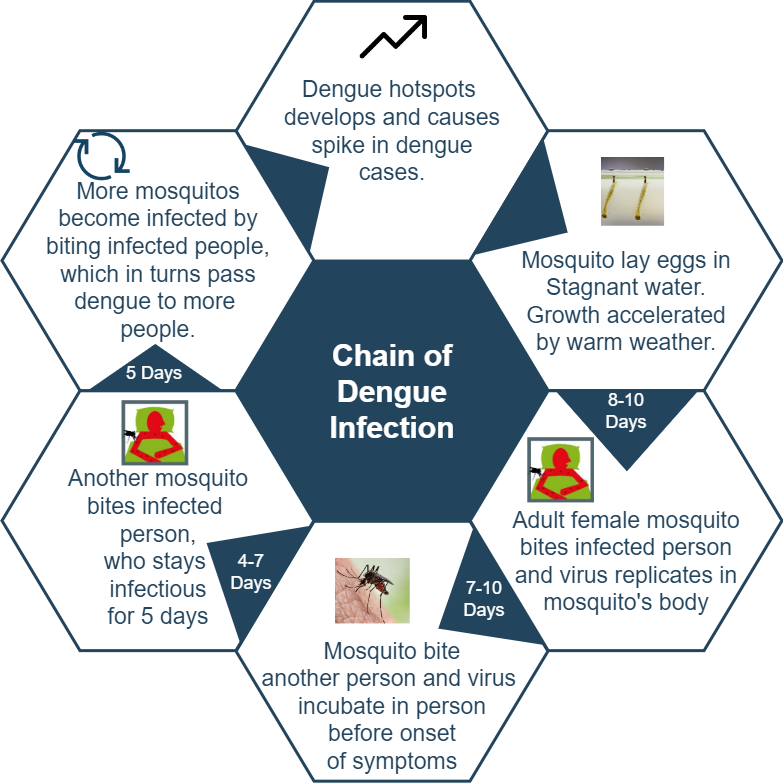
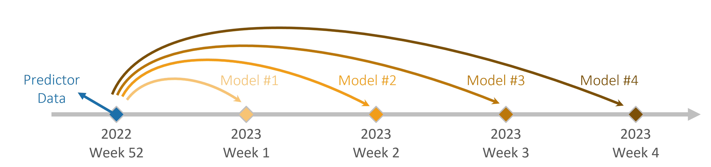

# Predictive Model for Dengue

 

    
**Primary Objectives:**

1. Build a predictive model to address the problem statement of when should the National Environment Agency (NEA) and Ministry of Health (MOH) allocate resources for dengue control more effectively?

----

## Background & External Research

Introduction  

Dengue virus is most commonly spread to humans through infected mosquitos. Dengue can range from asymptomatic infection or mild illness to severe disease. An estimated 1 in 4 dengue virus infections are symptomatic. Symptomatic dengue virus infection most commonly presents as a mild to moderate, nonspecific, acute febrile illness. Approximately 1 in 20 patients with dengue virus disease progress to develop severe, life-threatening disease called severe dengue. Severe disease (dengue hemorrhagic fever [DHF] / dengue shock syndrome [DSS]) can be induced by all four dengue virus (DENV) types (DENV-1, DENV-2, DENV-3, and DENV-4).

Singapore launched a comprehensive nationwide programme in 1968 targeting the Aedes mosquito, the main mosquito vector of dengue. This control programme combines environmental management, source reduction, public health education and law enforcement. Since then, the number of homes found to be breeding Aedes mosquito fell sharply and remains low. 

In 2016, Singapore embarked on a multi-phased field study named Project Wolbachia. Project Wolbachia involves the release of male mosquitoes infected with the Wolbachia bacteria. When these specially bred mosquitoes mate with urban female Aedes aegypti that do not carry Wolbachia, their resulting eggs do not hatch.

Despite concerted efforts, Dengue remains endemic in Singapore. Since the 1990s, there have been periodic spikes in cases occurring in five- to six-year cycles. The spike in 2019 and 2020 could be a case in point, coming after the epidemics in 2013 and 2014, which saw over 22,000 and 18,000 cases respectively. 

Several theories have been proposed to explain this cyclical pattern.   
> 1. The dengue virus has four different serotypes, and a switch in the predominant virus serotype has been a historical precursor of dengue epidemics in Singapore. For example, two large epidemics, each stretching over two years in 2004–2005 and 2013–2014, were associated with a switch in the main dengue virus serotype from serotype 2 to serotype 1.
> 2. Dengue in Singapore typically rises in warmer months, from April, peaking in July or August, before declining in September or October. Abnormal climate changes, such as the El Niño weather phenomenon, may affect the mosquito breeding environment, accelerate the life-cycle of Aedes mosquito, shorten the incubation period of the dengue virus and drive up cases. El Nino, a recurring weather pattern related to the warming of surface waters in the Pacific Ocean, last occurred in 2015–2016. It is slated to resume in 2023. 
> 3. Population factors also contribute to this endemic. The decrease in dengue transmission due to the successful implementation of the Aedes control programme in the 1970s and 1980s reduced incidence of dengue infection in the population. As herd immunity to dengue is consequently low, a large proportion of the Singapore resident population today remains susceptible to infection by any of the four dengue serotypes.

The entire lifecycle of an aedes female mosquito spans for about 42-56 days:  

References   
> * Centers for Disease Control and Prevention, National Center for Emerging and Zoonotic Infectious Diseases (NCEZID), Division of Vector-Borne Diseases (DVBD); url: https://www.cdc.gov/dengue/symptoms/index.html
> * National Centre for Infectious Diseases (2023). url: https://www.ncid.sg/Health-Professionals/Articles/Pages/Rise-in-dengue-cases-underscores-need-for-constant-vigilance.aspx#:~:text=Singapore%20is%20in%20the%20midst,the%202%2C772%20cases%20in%202017.
> * Meteorological Service Singapore (2023). url: http://www.weather.gov.sg/climate-el-la/
> * Mosquitos and Mosquito Borne diseases (NEA). url: https://www.nea.gov.sg/docs/default-source/resource/section-a---mosquitoes-amp-mosquito-borne-diseases-pdf-1-41-mb-.pdf
----

## Problem Statement

Problem Statement  

Given infection and serology, climate, geospatial, and google trends data, you have been tasked to predict the national-level dengue cases 16 weeks into the future. A more accurate method of predicting outbreaks of Dengue virus in mosquitos will help NEA and MOH plan when and where to allocate resources for dengue control more effectively. If cases are expected to rise sharply, there is a need to plan for more intensive control and enforcement measures to reduce mosquito breeding and consequentially dengue cases. Also quantify the costs and benefits of such control measures.

Stakeholders  

- Primary stakeholder(s): Ministry of Health (MOH), National Environment Agency (NEA), National Center of Infectious Diesease (NCID)  
>  * Public Health Prevention Awareness Campaigns 
>  * Mosquito Fogging Services 
>  * Airborne Pesticides
>  * Wolbachia Mosquitos Project
>  *  Mosquito Traps

- Secondary stakeholders: General Public for Awareness, Suppliers of Dengue Prevention Solutions

----
## Dataset

Dengue Infection Rate and Serology Data:   
* [Number of Dengue cases from 2018 to 2020](https://www.moh.gov.sg/resources-statistics/infectious-disease-statistics/2020/weekly-infectious-diseases-bulletin) 
* [Number of Dengue cases in 2021](https://www.moh.gov.sg/resources-statistics/infectious-disease-statistics/2021) 
* [Number of Dengue cases in 2022](https://www.moh.gov.sg/resources-statistics/infectious-disease-statistics/2022) 
* [Number of Dengue cases in 2023](https://www.moh.gov.sg/resources-statistics/infectious-disease-statistics/2023/weekly-infectious-diseases-bulletin) 
* [Serology data for Dengue between 2018 to 2023](https://www.nea.gov.sg/dengue-zika/dengue/quarterly-dengue-surveillance-data) 

Climate Data (1980 - 2023, planning area included):   
* [Daily historical climate data 1980 to 2023](http://www.weather.gov.sg/climate-historical-daily) 

Geospatial Data:    
* [Weekly geospatial dengue cluster data 2015 to 2020](https://outbreak.sgcharts.com/)

Google Trends Data:   
* [Weekly Google Trends data for dengue 2018 to 2023](https://trends.google.com/trends/explore?date=today%205-y&geo=SG&q=repellent%20%2B%20dengue%20fever%20%2B%20Dengue%20cluster%20%2B%20mosquito%20%2B%20mosquito%20repellent%20%2B%20dengue%20%2B%20aedes&hl=en)

## Data Dictionary
**Climate, serology and google search Data Dictionary**
|Variable|Description|Data type|
|--|--|--|
|time|Date of the dengue data, taken at sunday of every week from 2018 to 2023|datetime|
|dengue_cases|Weekly total number of dengue cases in NEA Weekly Infectious Diseases Bulletin|int|
|denv_1|Weekly percentage of dengue cases belonging to serotype DENV_1 obtained by NEA dengue surveillance|float|
|denv_2|Weekly percentage of dengue cases belonging to serotype DENV_2 obtained by NEA dengue surveillance|float|
|denv_3|Weekly percentage of dengue cases belonging to serotype DENV_3 obtained by NEA dengue surveillance|float|
|denv_4|Weekly percentage of dengue cases belonging to serotype DENV_4 obtained by NEA dengue surveillance|float|
|Mean Temperature (°C)|Weekly average temperature in °C in Changi from 1980 to 2023 |float|
|Mean Wind Speed (km/h)|Weekly average wind speed in km/h in Changi from 1980 to 2023 |float|
|Daily Rainfall Total (mm)|Weekly averaged daily total rainfall in millimeters in Changi from 1980 to 2023 |float|
|Maximum Temperature (°C)|Weekly highest temperature in °C in Changi from 1980 to 2023 |float|
|Max Wind Speed (km/h)|Weekly highest wind speed in km/h in Changi from 1980 to 2023 |float|
|Minimum Temperature (°C)|Weekly lowest temperature in °C in Changi from 1980 to 2023 |float|
|google_trends|Weekly number of searches for dengue related terms in Singapore scaled on a range of 0 to 100|int|
    
**Geospatial Data Dictionary**

|Region|latitude|logitude|
|--|--|--|
|CENTRAL REGION|103.8404361073424| 1.354955429489439|
|EAST REGION|103.9633839670078| 1.32796829772857|
|NORTH REGION|103.8371178947091| 1.415039440959387|
|NORTH-EAST REGION|103.8678180616185| 1.365201551765161|
|WEST REGION|103.7049024145101| 1.341611988409421|

 

|Variable|Description|Data type|
|--|--|--|
|date|Date of the cluster data from 2015 to 2020 from NEA |datetime|
|recent_cases_in_cluster_central|Weekly sum of average dengue cases (onset in the last 2 weeks) of clusters in central region of Singapore from 2015 to 2020|int|
|recent_cases_in_cluster_east|Weekly sum of average dengue cases (onset in the last 2 weeks) of clusters in East region of Singapore from 2015 to 2020|int|
|recent_cases_in_cluster_north|Weekly sum of average dengue cases (onset in the last 2 weeks) of clusters in North region of Singapore from 2015 to 2020|int|
|recent_cases_in_cluster_north-east|Weekly sum of average dengue cases (onset in the last 2 weeks) of clusters in Nort-East region of Singapore from 2015 to 2020|int|
|recent_cases_in_cluster_west|Weekly sum of average dengue cases (onset in the last 2 weeks) of clusters in West region of Singapore from 2015 to 2020|int|

----
## Technical Report

The technical report is split into 4 parts in the `code` folder.

1. [`01_data_preparation.ipynb`](./code/01_data_preparation.ipynb): A Jupyter notebook that cleans and merges the datasets, conducts Exploratory Data Analysis (EDA) on the dataset and exports the [`merged_df2.csv`](./datasets/merged_df2.csv) dataset into the `datasets` folder.
2. [`02_feature_engineering.ipynb`](./code/02_feature_engineering.ipynb): A Jupyter notebook that focuses on engineering relevant features based on the prelim analysis of the dataset and exports the [`data_features_with_lags.csv`](./datasets/data_features_with_lags.csv) into the `datasets` folder.
3. [`03_preprocessing_and_modelling.ipynb`](./code/03_preprocessing_and_modelling.ipynb): A Jupyter notebook that focuses on fitting the proposed models on a 1-week look ahead prediction and assessing the performance of each model using RMSE.
4. [`04_model_fitting_and_evaluation.ipynb`](./code/04_model_fitting_and_evaluation.ipynb): A Jupyter notebook that takes the best model families to fit up to 16-week ahead prediction to obtain the production model, and discusses the business evaluation of the model.

In addition to the Jupyter notebooks, there are 2 python scripts that contain user-defined functions to aid in the data cleaning and analysis.

1. [`modelling_functinos.py`](./code/modelling_functinos.py): user-defined functions for repeated actions in the notebooks.
2. [`DengueModel.py`](./code/DengueModel.py): user-defined class for building and running the 16-week lookahead model.
 

----
## Findings

### Performance Metric

Based on the business requirement of predicting the number of dengue cases 16 weeks into the future, the root mean squared error (**RMSE**) is chosen as the performance metric. NEA and MOH are likely to make decisions based on the predicted absolute number of dengue cases, as such the accuracy of the absolute number predicted is vital. Minimising the RMSE directly enhances the accuracy of the prediction of the absolute number of dengue cases, as compared to other metrics like percentage error which will have a non-linear relationship with actual case numbers depending on the number of cases at that point in time.

### Model Selection

As a start, 4 model families were trained for a 1-week look ahead prediction of dengue cases on data between 2019 and 2021. Then the models are validated on 2022 data to assess their performance. Prelim evaluation of the model families (see table below) shows that Boosting, Bagging and Support Vector perform well even without any hyperparameter tuning. In contrast, Time Series models have similar, if not worse, performance even after tuning. This also suggests that the seasonality of dengue cases may not be as consistent as a Time Series model can handle and/or historical training data is insufficient to fully understand and tune the seasonanlity components.

| Model Family | Model | RMSE |
|-----|-----|:-----:|
| Time Series | ARIMA (3,1,0) | 617 |
| Time Series | ARIMAX (1,1,2) | 262 |
| Time Series | SARIMA (1,1,2)(1,1,0,51) | 359 |
| Time Series | SARIMAX (1,1,2)(1,1,0,48) | 102 |
| Boosting | Gradient Boosting | 176 |
| Bagging | Bagging | 207 |
| Bagging | Random Forest | 192 |
| Support Vector | Support Vector Machine | 141 |

### Model Tuning and Evaluation

To forecast 16 weeks ahead from the current time, we use current data and fit one dedicated model for each week’s forecast (see illustration below). The dedicated model is chosen from the best performing of the 3 model families after hyperparameter tuning.
 

Visually, the 16-week ahead forecasting model performs very well at 3 randomly selected time points in the 2022 validation dataset. RMSE on the dataset is **103** which is also very good. When the model is tested on unseen 2023 data (10 weeks worth), the performance is even better at RMSE of **13**. We will deploy this model to address the problem statement. 
 

One observation is that predictions start to deviate from actual cases after 10 weeks, which is symptomatic of how the RMSE for the first 10 weeks is very low (i.e. ~10), but overall RMSE is a magnitude (i.e. ~100). We will discuss improvements to the model in the latter sections.
 
### Cost Benefit Analysis

There are currently various measures deployed in Singapore to control the dengue cases, which can be categorized into reactive and preventive measures.
* Reactive Measures: Distribution of mosquito repellent, fogging
* Preventive Measures: Home inspections, anti-dengue campaigns, gravi-traps, project wolbachia

For our project, we will be focusing on the cost and benefit of Project Wolbachia. 
*Economic Impact of Dengue*  
* Over $1 Billion annually between 2010 to 2020
* For years with huge spikes like 2020 and 2022, the expected economic impact is much higher

#### Project Wolbachia

* Nation-wide deployment throughout the year is expected to cost approx. $108 Million
* A reduction of up to 88% of dengue cases is observed before deployment of Project Wolbachia
* Effectiveness of the project is not dependent on people compared to other measures, which replies on the population's due diligence to contain dengue mosquitos
* Requires 3 - 4 months to suppress mosquito population

*Cost Savings from Project Wolbachia*  
The expected savings from a year-round deployment of Project Wolbachia is approx. SGD 770 Mil. 

----

## Conclusion

1. The model is able to perform well in terms of identifying the trend. Furthermore, its error rate is relatively low, with an RMSE score of 91. 
2. The model will serve well as an early detection tool, where the approximate measure can be implemented based on whether a minor or major spike is predicted. 
    * Minor Spikes: Use existing dengue measures
    * Major Spikes: Deploy Project Wolbachia
3. We would also recommend to deploy Project Wolbachia nationally throughout the year, to reduce the number of dengue cases and help meet NEA's KPI of reducing the weekly case load to under 100. Furthermore, based on our CBA, a cost savings of over $700 Million is achieved.

### Future Improvements

We would also recommend the following improvements for the future:
1. To increase our data collected
    * Town level dengue cases: By collecting the town level dengue cases, we will be able to be more targeted with the deployment of Project Wolbachia, which would significantly reduce its cost
    * Age group of populations in town: Older generations are more susceptible to severe disease. By having this data, towns with more susceptible populatiosn can be prioritized if resources are lean. 
    * More historical data: Having more historical data would be helpful with training a more accurate model
2. Engage domain experts
    * Domain experts wil be able to use their in-depth knowledge and expertise to assist with feature selection and feature engineering. 
