<!--
*** Writing this summary to condense the learning points from our exploratory data analysis!
-->

<!-- TABLE OF CONTENTS -->

  
Table of Contents

  <ol>
    <li><a href="#summary">Summary</a></li>
  </ol>

## Summary

1. Temperature and Rainfall  

> A regression line illustrates higher rainfall leads to lower mean temperature from 1980 to 2023.  

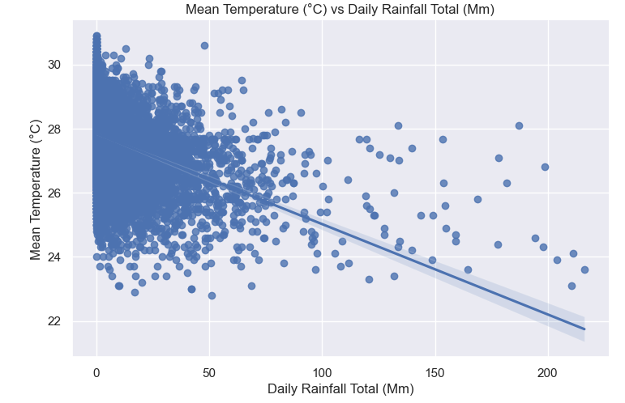

> We can observe a yearly seasonal pattern of temperature from 1980 to 2023  
> Slicing by years we can see temperature is highest in 2016 and 2019, and lowest in 2023 recently.  
> Slicing by months we can see temperature is highest in months of May-July across 1980 to 2023.  

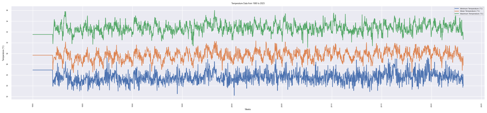

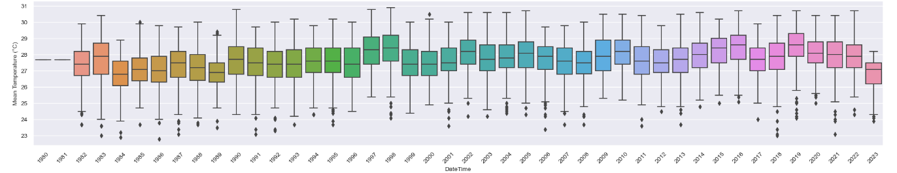

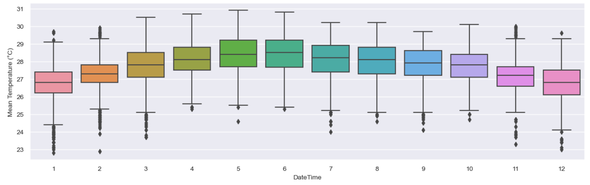

> We can observe a yearly seasonal pattern of wind speed from 1980 to 2023, but the pattern is more noisy than temperature  
> Slicing by years we can see 2019 is the most windy year, and 2022 is least windy recently.  
> Slicing by months we can see april-may and october-november is least windy months across 1980 to 2023.  

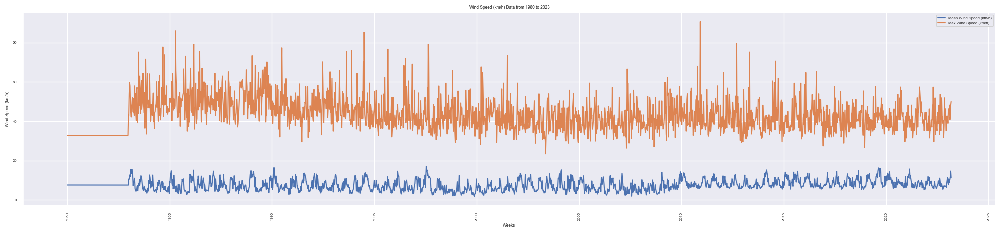

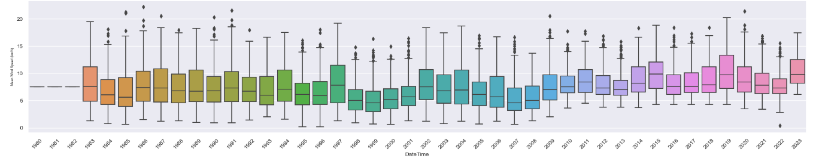

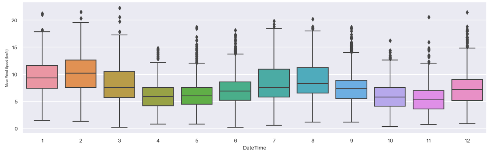

> We can observe a yearly spikes in rainfall from 1980 to 2023, the pattern is also more noisy than temperature  
> Slicing by years we can see 2016 and 2019 is least rainy years, and 2023 is most rainy year recently.  
> Slicing by months we can see november-december are most rainy months across 1980 to 2023.  

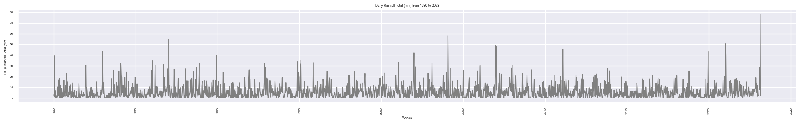

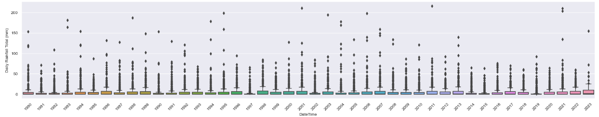

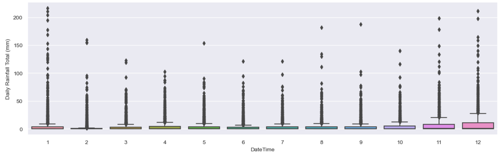

> April to September are the hottest months, and 2016 and 2019 are the hottest years recently  

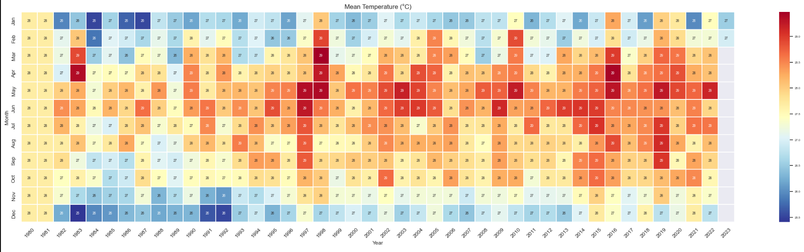

> Merged dataset from 2015 to 2020  

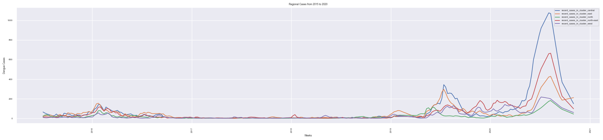

2. Dengue cases from 2018 to 2023
> Dengue cases spikes during the circuit breaker period, it might be influenced by many people staying indoors.

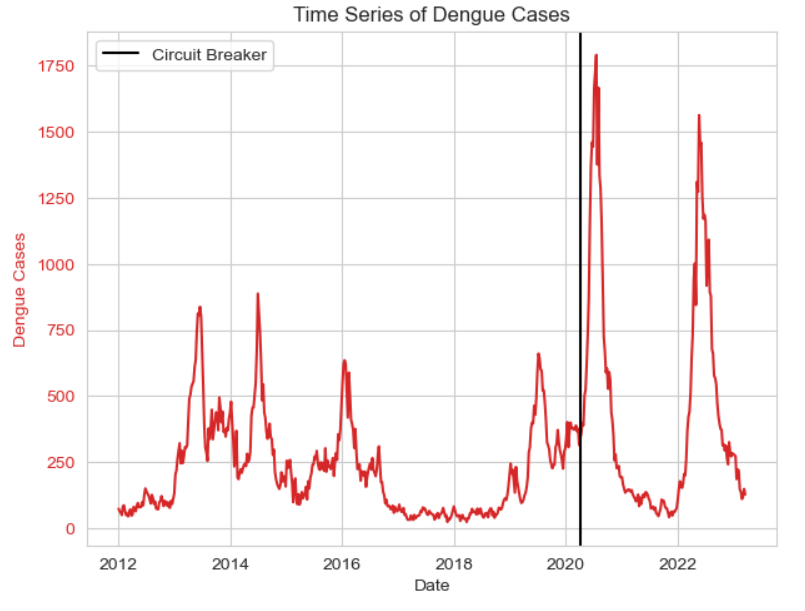

> Dengue cases is highest in May-July and is preceded by rainy months

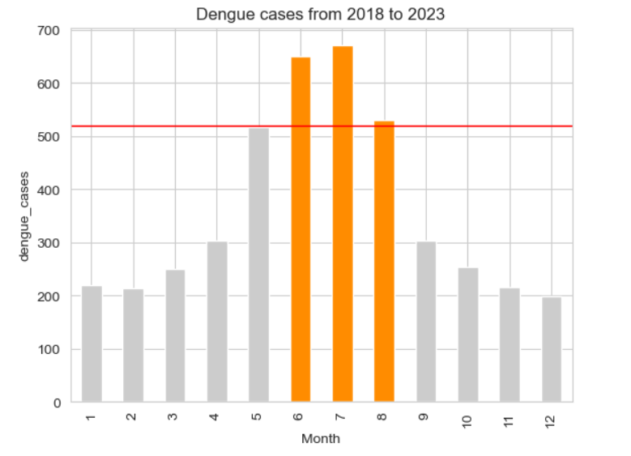
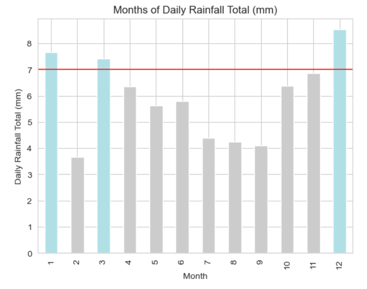

> The temperature fits the optimum average temperature for mosquito growth and activity at 25–30 °C.
> The temperature is also optimal for replication of dengue virus in the mosquito. 
> Temperature do not determine how high the spikes will be every year

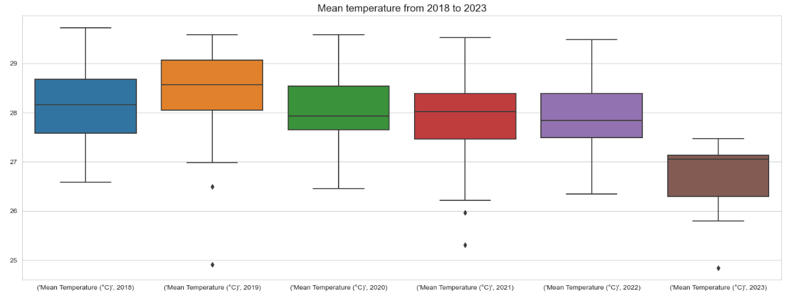

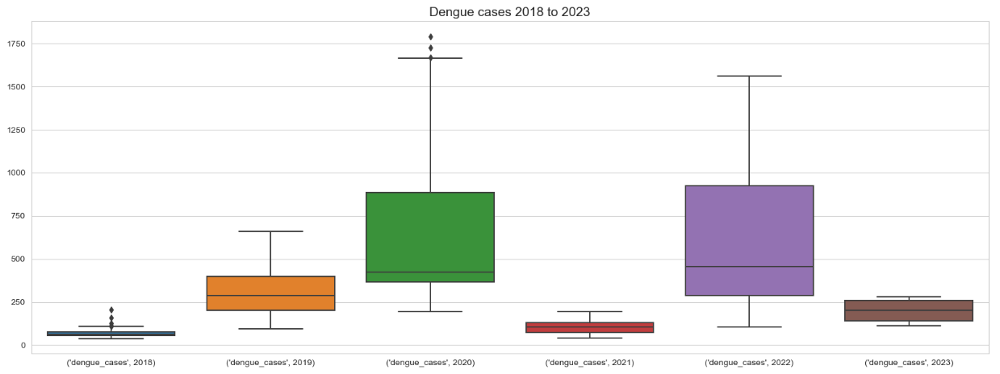

> Dengue cases matches the spikes and fluctuations in google trends. 
> Comparison of decomposition of trends and seasons side-by-side shows same spike in july each year.

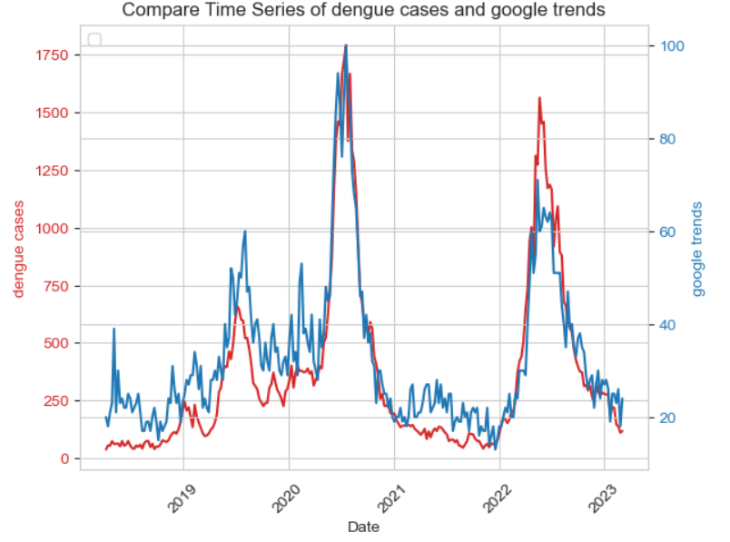

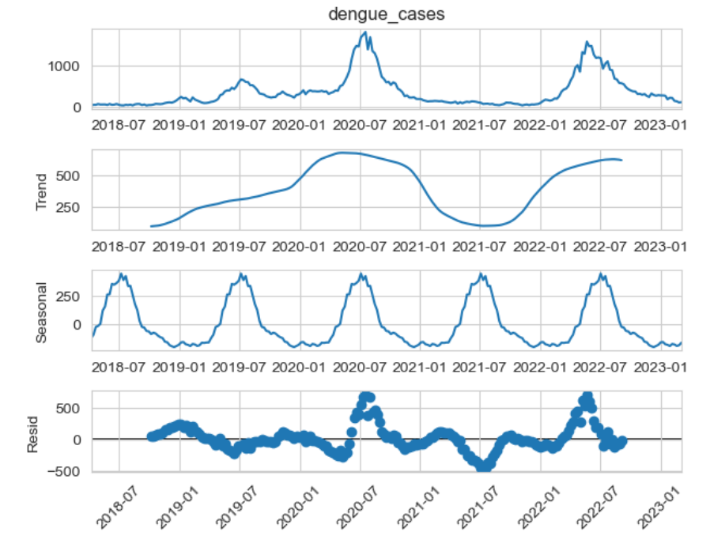
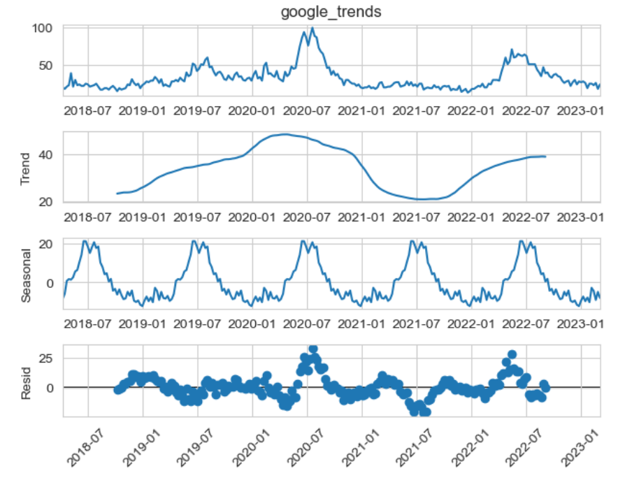

>**Findings**
> DENV_3 is the dominant strain from 2021 onwards, but the percentage is falling in 2023.
> DENV_2 percentage has dropped significantly since 2021 due to herd immunity.
>* We can observe that lack of population immunity to denv 3 (In Pink) may have influenced the large dengue cases spikes in 2020 and 2022
>* Hence, we suggest combining the 4 serology features (DENV_1 to 4) into a single susceptibility ratio to reduce dimension and capture the population susceptibility to the dengue virus.
>* More details on this susceptibility ratio can be found in [02 Feature engineering Notebook](../code/02_feature_engineering.ipynb)

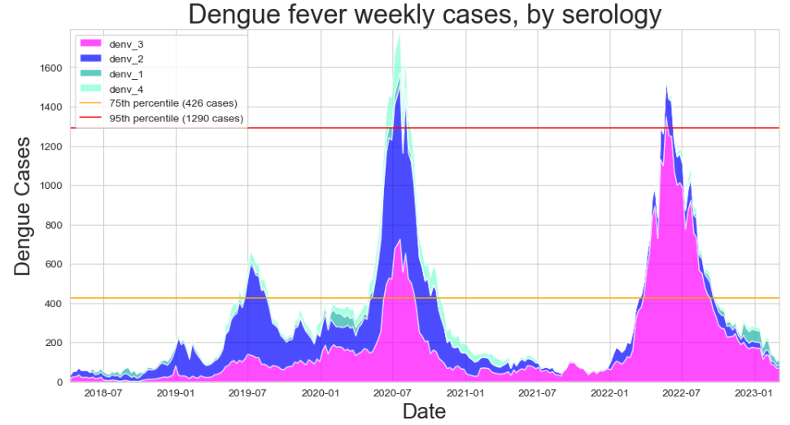

>**Findings of pearson correlation of multiple features with dengue cases with positive lags**
>1. Google trends has very good correlation with no week lags
>2. Mean temperature has higher correlations at 0-12, 24-32 and 41-52 week lags
>3. Mean wind spead has higher correlations at 5-7, 17,25 and 43-51 week lags
>4. Rainfall has no significant correlation at different week lags
>5. Maximum temperature have higher correlation at 7-17 week lags
>5. Maximum wind speed have higher correlation at 12-17 and 38-51 week lags
>
>This matches with the CCF plots in [02 Feature engineering Notebook](../code/02_feature_engineering.ipynb)
>
>Note: CCF and pearson correlation give the same results, the difference is how they treat NA values.

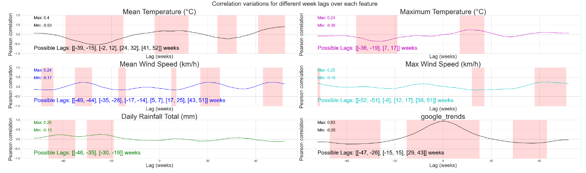

> Mean temperature have 0 to 12 weeks time lag, which is explained as yearly, the rise in temperature begins in April, which is around 2-3 months earlier than rise in dengue cases. The peak in temperature coincides with the peak in dengue cases.  
> However, the lag in rainfall is not consistent from the chart.

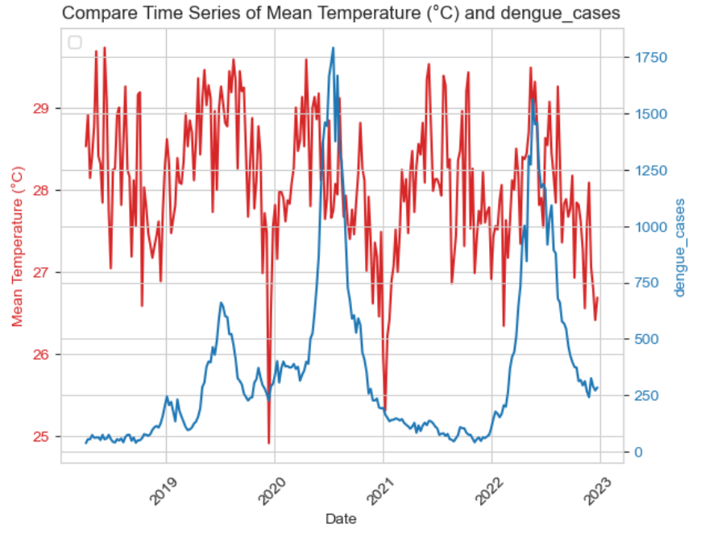
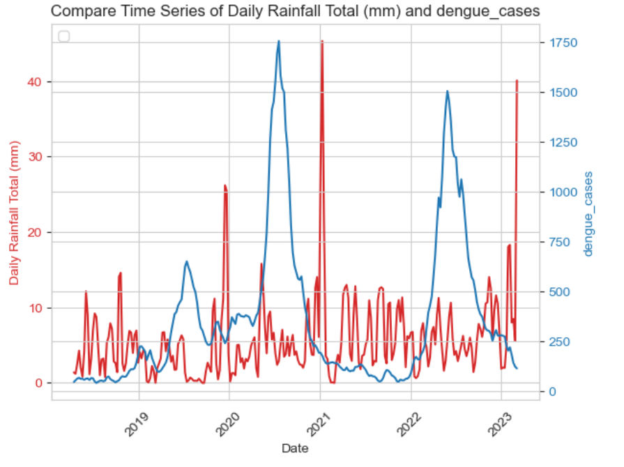

(<a href="#readme-top">back to top</a>)
